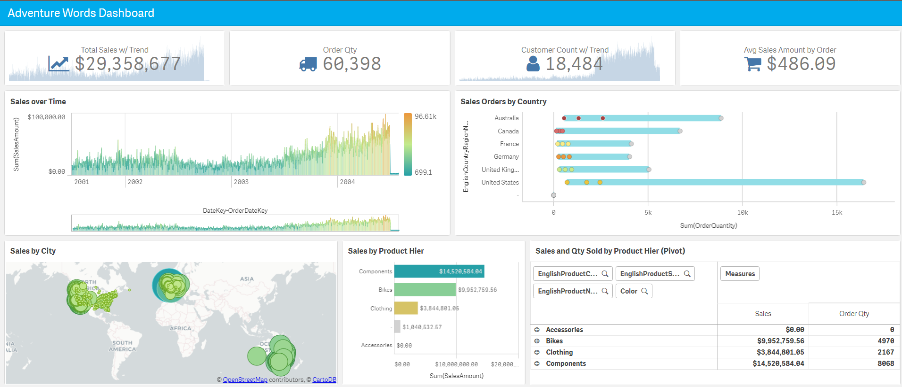

General Notice

Product names used herein are for identification purposes only, and may be
trademarks of their respective companies.

Introduction
------------

The purpose of the document is to provide a step-by-step guide of how to get
Qlik Sense working with the Azure SQL Data Warehouse solution on the Azure
platform.

Technology Terms and Definitions
--------------------------------

**Azure SQL DB**:

General-purpose managed relational database service in Azure. This means
Microsoft handles all patching and updating of the underlying infrastructure
while you get to just use the database. It delivers dynamically scalable
performance allowing you to scale database performance up/down and only pay for
what you need. It shares a code base with Microsoft SQL Server and supports
structures such as relational data, JSON, spatial, and XML.

**Azure SQL DW**:

Cloud-based managed data warehouse that leverages Massively Parallel Processing
(MPP) to quickly run complex queries across petabytes of data. Azure SQL DW is a
key component of an end-to-end big data solution in the Azure cloud. Like with
Azure SQL DB, Microsoft handles all patching and updating of the underlying
infrastructure. It also delivers dynamically scalable performance allowing you
to scale data warehouse performance up/down in minutes. In addition, you can
independently scale compute and storage, and pause and resume the data warehouse
to match the rhythms of your business.

Why Qlik Sense
--------------

Qlik Sense gives you data superpowers. Easily combine all your data sources, no
matter how large, into a single view. Qlik’s Associative engine indexes every
possible relationship in your data so you can gain immediate insights and
explore in any direction your intuition takes you. Unlike query-based tools,
there’s no pre-aggregated data and predefined queries to hold you back. That
means you can ask new questions and create analytics without having to build new
queries or wait for the experts.

**Interactive analysis, without boundaries**

Ask any question and quickly explore across all your data for insight, using
global search and interactive selections. All analytics update instantly with
each click, no matter how deep you go, furthering analysis or pivoting your
thinking in new directions. There’s is no limit to exploration and no data left
behind.

**Simply smarter visualizations**

Innovative visualizations put your data in the right context to answer any
question. Explore the shape of data and pinpoint outliers. Use advanced
analytics integration and geographic calculation to broaden insight. And it's
fully interactive - easily pan, zoom, and make selections to find insights
visually.

**Create and explore on any device**

Explore, create, and collaborate on any device, directly at the point of
decision. Qlik Sense is built from the ground up with responsive mobile design
and touch interaction. Build analytics apps once, and they’ll work everywhere,
on desktop, tablet, or mobile devices.

To learn more, go to <https://www.qlik.com/us/products/qlik-sense>

Configuration & Setup 
======================

Azure SQL DW Setup
------------------

### Azure Console – Add new SQL Data Warehouse (Using Sample ADworks Database)

Starting in the Azure console, select “SQL data warehouses” from the list of
resources (you might have to add under “All services” if it’s not on the default
list. Once that control panel opens, choose “Add”.

Make the selections that match your configuration (I used an existing resource
group), You may need to create a server to host the data warehouse as well.  

Once I’ve made my selections and everything checks out ok – click “Create” to
start the new SQL DW.

A message will appear:  

After a while – the startup will complete, and the new Azure SQL DW is ready to
go.

Qlik Sense VM on Azure Setup (using Marketplace)
------------------------------------------------

For the purposes of testing, we decided to use a small Azure VM (4 core – 32GB
RAM) to test Qlik Sense. This the final configuration is from our test machine,
lets walk through example steps of how we created this Qlik Sense machine.  

Azure Windows Server Setup
--------------------------

-   The process of configuration of the VM is very straightforward, we start in
    Azure Marketplace searching for Qlik.  
    

    

    

-   After a few minutes, a screen will appear to add our Qlik License (available
    from Qlik.com). Click create.  
    

    

-   Fill out the required elements, I mapped to an existing Resource group and
    used the BYOL option for Windows server.  
    

    

-   For the purposes of the Quick start, I chose a small 4 core, 16GB RAM box.
    Please refer to the Qlik Sense sizing guides for your installation
    (<https://community.qlik.com/docs/DOC-8878>)

-   After that – some more configuration settings around server /networking – (I
    chose to use an existing virtual network and security group).  
    

    

-   All set – ready to launch. After a few minutes, the system is up and running
    and ready for the Qlik Server install.  
    

    

Testing and Results 
====================

Connecting to Qlik Sense on Azure 
----------------------------------

-   Looking at our control panel for Azure, we can see the VM is now running. We
    can connect to the URL to access Qlik Sense. Follow the Qlik Sense guide for
    specifics on finishing the Qlik Sense install
    (<https://help.qlik.com/en-US/sense/April2018/Subsystems/PlanningQlikSenseDeployments/Content/Deployment/Qlik-Sense-installation.htm>)

-   This validation/install was performed using April 2018 release of Qlik
    Sense.

Connecting Azure SQL DW to Qlik Sense 
--------------------------------------

-   Opening our Qlik Sense server and signing in, we click to “Create a new app”

    

-   Give the app a name and click create  
    

    

-   Open the app and “Add data from files and other sources”  
    

    

-   Select Microsoft SQL Server (future versions may call our Azure SQL DW/DB
    separately)  
    

    

-   Add the connection string information:

    

-   Select the tables required:

    

-   Check the data model:  
    

    

-   Load data, and build the app:  
    

    

-   A copy of this sample app can be download here:    (<https://github.com/Qlik-PE/Qlik_AzureSQLDW_QuickStart/blob/master/Azure%20SQL%20Data%20Warehouse.qvf>)
